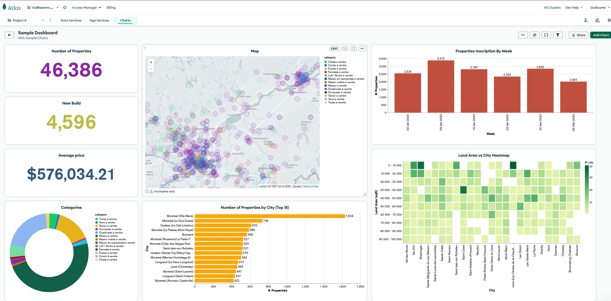
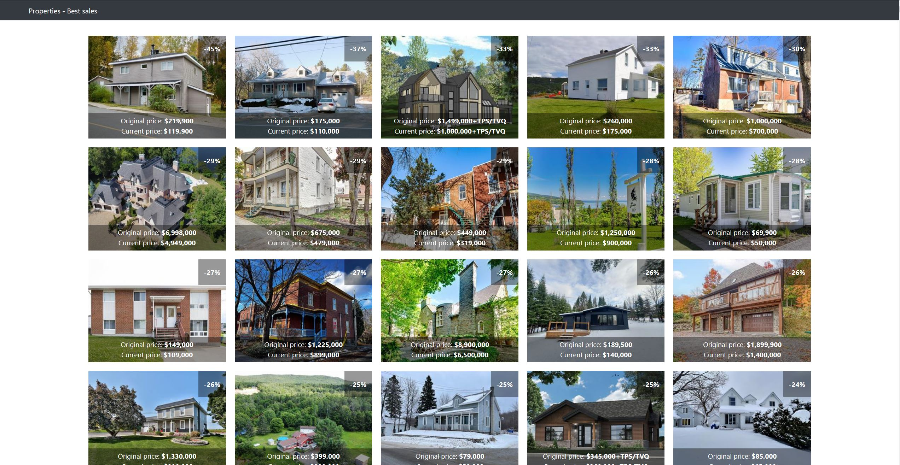

# Property for Sale

The project has been developed using the Python programming language and leverages the Centris.ca platform to retrieve all properties for sale in the region. The retrieved information is then stored in a MongoDB database, which acts as a centralized repository for the data.

The project runs on a daily basis to keep the database up to date by adding new properties and updating prices history per property. This provides a real-time view of the market trends, making it easy to spot changes and fluctuations.

In addition to the data storage, the project also includes an interactive dashboard built using MongoDB Atlas charts tool. This dashboard provides an intuitive and visually appealing way to view key statistics about the housing market, including trends and patterns over time.

The final component of the project is a Flask web application that showcases the best sales. The application looks at the price history of each property and compares the starting price with the current price to determine the best deals. This information can be used by real estate professionals, buyers, and sellers to make informed decisions about the market.

Overall, this project provides a comprehensive and user-friendly solution for monitoring the housing market in Québec, Canada, making it an invaluable resource for anyone interested in the region's real estate market.